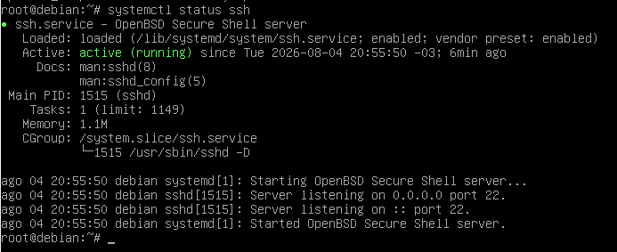
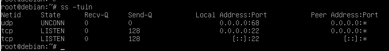
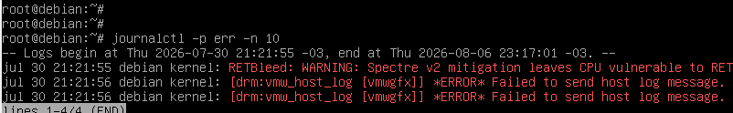
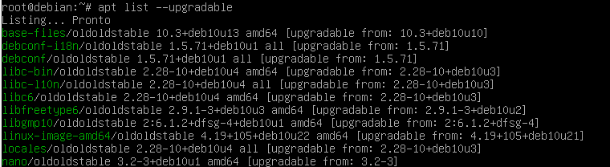

# Linux Hardening Lab


---

## Objetivo

Este projeto demonstra a aplicação de técnicas de Hardening em sistemas Linux utilizando Debian.

O objetivo é construir um laboratório prático de Cibersegurança documentando procedimentos de administração, auditoria e segurança.

---

# Estrutura

```text
linux-hardening-lab/
├── assets/
├── docs/
├── reports/
├── screenshots/
├── scripts/
├── README.md
└── LICENSE
```

---

# Conteúdo

- Estrutura do Linux
- Gerenciamento de Usuários
- Permissões
- SSH
- Firewall (UFW)
- Serviços
- Logs
- Atualizações
- Cron
- Hardening

---

# Ferramentas

- Debian
- Bash
- OpenSSH
- UFW
- systemd
- Git
- GitHub

---

## Documentação

- [Informações do Sistema](docs/system-information.md)
- [Usuários](docs/users.md)
- [Permissões](docs/permissions.md)
- [SSH](docs/ssh.md)
- [Firewall](docs/firewall.md)
- [Serviços](docs/services.md)
- [Logs](docs/logs.md)
- [Atualizações](docs/updates.md)
- [Cron](docs/cron.md)
- [Hardening](docs/hardening.md)
- [Relatório Executivo](reports/final-report.md)
---


## Evidências

### Auditoria de SSH



### Firewall



### Logs



### Atualizações



# Licença

MIT License